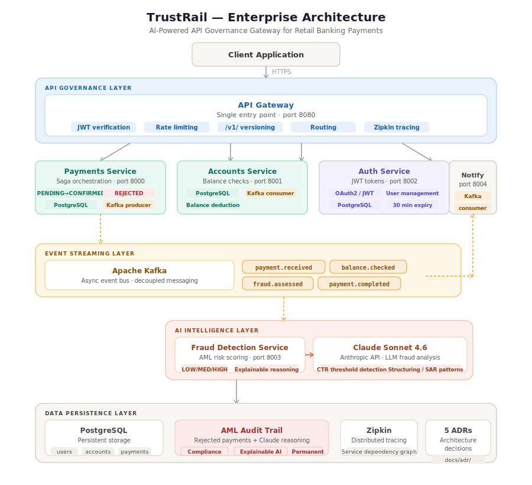

# TrustRail — AI-Powered API Governance Gateway for Retail Banking Payments

An enterprise API governance platform for retail banking payments, featuring OAuth2/JWT authentication, event-driven microservices via Kafka, AI-powered fraud detection using Claude Sonnet 4.6, distributed tracing with Zipkin, and a full distributed saga pattern for payment confirmation.

## Quick start

```bash
# Add your Anthropic API key to .env first
echo "ANTHROPIC_API_KEY=your-key-here" > .env

# Start the entire system
docker compose up --build
```

All ten services start automatically in the correct order.

## Overview

TrustRail demonstrates how an API Gateway centralizes governance — OAuth2/JWT authentication, rate limiting, and versioning — in front of independent backend microservices. Payment events flow through a distributed saga pattern via Kafka, triggering parallel processing by an Accounts Service (balance validation) and an AI-powered Fraud Detection Service using Claude Sonnet 4.6. Every request is traced end-to-end with OpenTelemetry and Zipkin. Rejected payments are stored in PostgreSQL with Claude's AML reasoning for compliance investigation.

## Architecture



```
                    ┌──────────────────────┐
   Client/App ────▶ │     API Gateway      │  (port 8080)
                    │  - JWT verification  │◀── Zipkin trace span
                    │  - Rate limiting     │
                    │  - v1 versioning     │
                    └──────────┬───────────┘
                               ▼
                      Payments Service        (port 8000)
                      Creates PENDING payment
                      Publishes payment.received
                               │
                    ┌──────────▼──────────┐
                    │    Kafka Event Bus   │
                    └──────┬──────────────┘
               ┌───────────┴───────────┐
               ▼                       ▼
      Accounts Service        Fraud Detection Service
      (port 8001)             (port 8003)
      Checks balance          Claude Sonnet 4.6
      Publishes               AML risk scoring ◀── Zipkin trace span
      balance.checked         Publishes fraud.assessed
               └───────────┬───────────┘
                           ▼
                  Payments Service
                  CONFIRMED or REJECTED
                  Publishes payment.completed
                  Stores rejected payments
                  in PostgreSQL with AI reasoning
                           │
                           ▼
                Notifications Service   (port 8004)
                Payment alerts
```

## Services

| Service | Port | Responsibility | Storage |
|---|---|---|---|
| API Gateway | 8080 | JWT auth, rate limiting, versioning, routing | N/A |
| Payments Service | 8000 | Saga orchestration, payment lifecycle | PostgreSQL |
| Accounts Service | 8001 | Balance checks, deposits, Kafka consumer | PostgreSQL |
| Auth Service | 8002 | JWT tokens, user management | PostgreSQL |
| Fraud Detection | 8003 | Claude Sonnet 4.6 AML risk scoring | In-memory |
| Notifications | 8004 | Payment alerts via Kafka | In-memory |

## Infrastructure

| Component | Purpose | Port |
|---|---|---|
| PostgreSQL | Persistent storage for all services | 5432 |
| Kafka | Async event bus for inter-service messaging | 9092 |
| Zookeeper | Kafka cluster coordinator | 2181 |
| Zipkin | Distributed tracing UI | 9411 |

## Observability

TrustRail uses OpenTelemetry for distributed tracing across all services, with Zipkin as the trace visualization UI.

### View traces

Open Zipkin at `http://localhost:9411` after starting the system.

Every payment request generates a full trace showing:
- **JWT verification** at the Gateway (manual span)
- **Gateway → Payments** routing with timing
- **Payments** saga processing
- **Claude API call** in Fraud Detection (manual span with risk level, confidence, model name)

### View service dependency graph

In Zipkin, click **Dependencies** to see the automatically discovered service topology — no manual configuration needed. Zipkin builds this from real traffic.

### Trace attributes

| Span | Key attributes |
|---|---|
| `jwt.verify` | `auth.username`, `auth.role`, `auth.valid` |
| `claude.fraud_assessment` | `payment.id`, `payment.amount`, `llm.model`, `fraud.risk_level`, `fraud.confidence` |

## Kafka Topics

| Topic | Published by | Consumed by |
|---|---|---|
| payment.received | Payments | Accounts, Fraud Detection |
| balance.checked | Accounts | Payments |
| fraud.assessed | Fraud Detection | Payments |
| payment.completed | Payments | Notifications |

## AI Fraud Detection

Claude Sonnet 4.6 analyzes every transaction for AML compliance patterns:

| Amount | Risk | Action | Claude's reasoning |
|---|---|---|---|
| $100 | LOW | APPROVE | Normal retail threshold |
| $9,999 | HIGH | REVIEW | Classic structuring — just below $10k CTR threshold |
| $999,999 | HIGH | BLOCK | Near $1M threshold, SAR obligations triggered |

Rejected payments stored permanently in PostgreSQL with full Claude reasoning for compliance investigation.

```bash
# Check fraud assessments
curl http://localhost:8003/assessments

# Check rejected payments (AML audit trail)
curl http://localhost:8000/rejected
```

## Example usage

### Step 1: Get a JWT token

```bash
curl -X POST http://localhost:8002/token \\
  -d "username=alice&password=alice123" \\
  -H "Content-Type: application/x-www-form-urlencoded"
```

### Step 2: Use the token in all Gateway requests

```bash
# Check account balance
curl -H "Authorization: Bearer YOUR_TOKEN" \\
  http://localhost:8080/v1/accounts/ACC1001/balance

# Initiate a payment (triggers full saga)
curl -X POST http://localhost:8080/v1/payments/ \\
  -H "Authorization: Bearer YOUR_TOKEN" \\
  -H "Content-Type: application/json" \\
  -d '{"from_account": "ACC1001", "to_account": "ACC2002", "amount": 300, "currency": "USD"}'

# Check payment status
curl -H "Authorization: Bearer YOUR_TOKEN" \\
  http://localhost:8080/v1/payments/{payment_id}

# Deposit funds
curl -X POST http://localhost:8080/v1/accounts/ACC1001/deposit \\
  -H "Authorization: Bearer YOUR_TOKEN" \\
  -H "Content-Type: application/json" \\
  -d '{"amount": 1000}'

# View notifications
curl http://localhost:8004/notifications

# View rejected payments with AI reasoning
curl http://localhost:8000/rejected
```

### User management

```bash
# Create user
curl -X POST http://localhost:8002/users \\
  -H "Content-Type: application/json" \\
  -d '{"username": "bob", "password": "bob123", "role": "user"}'

# List users
curl http://localhost:8002/users

# Disable user
curl -X DELETE http://localhost:8002/users/bob
```

### Demo credentials

| Username | Password | Role |
|---|---|---|
| alice | alice123 | user |
| admin | admin123 | admin |

## Governance features

- **OAuth2/JWT** — signed tokens, 30 min expiry, verified at Gateway on every request
- **Database-backed users** — managed via API, disabled users cannot get tokens
- **Rate limiting** — 5 requests per minute per client
- **API versioning** — `/v1/` prefix
- **Event-driven saga** — parallel async processing via Kafka
- **AI fraud detection** — Claude Sonnet 4.6 with explainable AML reasoning
- **Audit trail** — rejected payments stored permanently in PostgreSQL
- **Distributed tracing** — OpenTelemetry + Zipkin across all services

See `docs/adr/` for architectural decision records.

## Tech stack

- Python 3.12
- FastAPI (microservices + gateway)
- SQLAlchemy + PostgreSQL (persistent storage)
- Claude Sonnet 4.6 / Anthropic SDK (AI fraud detection)
- python-jose (JWT authentication)
- kafka-python-ng (event-driven messaging)
- OpenTelemetry + Zipkin (distributed tracing)
- httpx (synchronous inter-service calls)
- slowapi (rate limiting)
- Docker + Docker Compose (containerization)

## Environment variables

Create a `.env` file in the root (never commit this):

```
ANTHROPIC_API_KEY=your-api-key-here
```

## Architecture Decision Records

| ADR | Decision |
|---|---|
| 001 | API Gateway pattern over service mesh |
| 002 | API key authentication (interim, replaced by JWT) |
| 003 | URI-based versioning (/v1/) |
| 004 | OAuth2/JWT replacing API keys |
| 005 | Event-driven fraud detection via Kafka + Claude Sonnet 4.6 |

## Status

Complete portfolio project demonstrating enterprise API governance patterns for retail banking. Fully containerized with PostgreSQL, Kafka, JWT auth, AI-powered AML fraud detection, and OpenTelemetry distributed tracing.

## Future improvements

- Automated tests (unit + integration)
- Managed Kafka (Confluent Cloud) for production
- PostgreSQL read replicas for reporting queries
- Prometheus + Grafana for metrics dashboards
